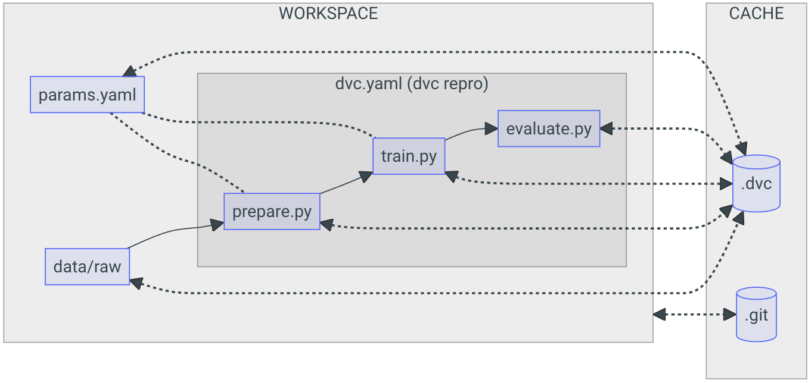

# Celestial Body Classification: A Guide to MLOps with DVC

Welcome to an advanced guide on implementing Machine Learning Operations (MLOps) with a focus on Data Version Control (DVC) for the classification of celestial bodies. This repository, part of [A Guide to MLOps](https://swiss-ai-center.github.io/a-guide-to-mlops/), is designed to showcase best practices in managing and versioning datasets and machine learning models.

## Overview

Incorporating DVC into our MLOps workflow allows for efficient data management, ensuring reproducibility and traceability of data and models. This project aims to give recommendations to the process of setting up DVC, versioning your data and models, and integrating these practices into a seamless MLOps workflow.

### Workflow Diagram



The diagram above provides a visual representation of my MLOps workflow, enhanced with DVC for data and model versioning. The workflow includes:

1. **Data Preparation**: Utilizing DVC to version and manage datasets.
2. **Model Training**: Training models with versioned data.
3. **Model Evaluation**: Evaluating model performance with traceability to specific data versions.

## Getting Started

### Prerequisites

- Python 3
- DVC (You can install DVC via pip: `pip install dvc` or follow the [official installation guide](https://dvc.org/doc/install)).

### Installation

1. Clone this repository and navigate into it.
2. Install the required Python dependencies:
   ```bash
   pip install -r requirements.txt
   ```
3. Initialize DVC:
   ```bash
   dvc init
   ```


### Project Workflow
To fully leverage DVC in this project, follow these steps:

- **run the steps of the workflow**:
```bash
dvc repro
```

- **Compare the parameters difference**:
```bash
# Compare the parameters' difference
dvc params diff
```

- **Compare the metrics difference**:
```bash
# Compare the metrics' difference
dvc metrics diff
```

- **Compare the plots difference**:
```bash
# Create the report to display the plots
dvc plots diff --open
```

## Contributing

Contributions are what make the open-source community such an amazing place to learn, inspire, and create. Any contributions you make are **greatly appreciated**.

## License

Distributed under the MIT License. See `LICENSE` for more information.