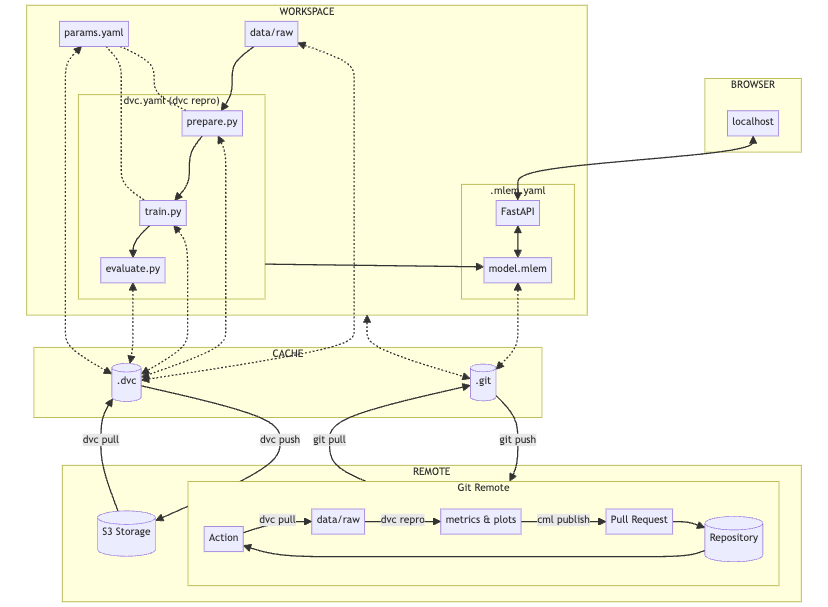

# Celestial Body Classification: A Guide to MLOps with DVC

Welcome to an advanced guide on implementing Machine Learning Operations (MLOps) for the classification of celestial bodies. This repository, part of [A Guide to MLOps](https://swiss-ai-center.github.io/a-guide-to-mlops/), is designed to showcase best practices in managing and versioning datasets and machine learning models.

## Overview

This MLOps workflow leverages the strengths of DVC for data and model versioning, Git for code management, and FastAPI for serving models, facilitated by MLEM for seamless model management. It supports a comprehensive cycle of preparing data, training models, evaluating performance, and serving predictions, all within a version-controlled, collaborative, and reproducible environment. Continuous integration and deployment processes ensure that model improvements are systematically reviewed and integrated, enhancing the model's reliability and performance over time.


### Workflow Diagram



Here’s a summarized explanation of how this workflow operates:

### Data and Model Management with DVC

- **DVC Storage**: The `.dvc` directory works in conjunction with S3 Storage to manage datasets and model artifacts. `dvc push` uploads data and models to S3 Storage for versioning and backup, while `dvc pull` retrieves them into the local `.dvc` directory for use or further development.
- **Version Control with Git**: The `.git` directory interacts with a Git remote repository. Changes in the project (code, models, and configurations) are pushed to the Git remote for version control and collaboration, and updates can be pulled from the remote repository into the local workspace.

### Workflow in the Workspace

- **Experimentation and Model Development**: The workspace involves several key scripts and configurations:
  - `prepare.py` for data preprocessing.
  - `train.py` for model training.
  - `evaluate.py` for model evaluation.
  These scripts interact with both the `.dvc` for data/model artifacts and `.git` for tracking changes.
- **Parameter Management**: `params.yaml` is used to store and manage parameters that influence the preparation, training, and evaluation steps. It's version-controlled with DVC and Git to ensure reproducibility.

### Remote Operations and Continuous Machine Learning (CML)

- **Remote Storage and Versioning**: A remote setup is outlined involving S3 Storage for data/models and Git Remote for code and configuration. This enables a distributed environment where data, models, and code can be shared and versioned.
- **Continuous Integration and Deployment (CI/CD)**: The workflow includes an automated process where:
  - An action in the Git repository triggers `dvc pull` to retrieve the latest data and models.
  - `dvc repro` is used to rerun the experiments, generating new metrics and plots.
  - Results are published to a pull request (PR) via CML, allowing for review and collaboration before changes are merged into the main repository.

### Model Serving

- **MLEM for Model Management**: `.mlem.yaml` configures how models are managed and served, integrating with FastAPI to create a REST API for model inference.
- **FastAPI for Serving**: The model is served locally via FastAPI, providing endpoints for interaction, such as model predictions. This setup allows for easy testing and interaction with the model through a web browser.


## Getting Started

### Prerequisites

- Python 3
- tensorflow
- DVC 
- MLEM 
- fastAPI

### Installation

1. Clone this repository and navigate into it.
2. Install the required Python dependencies:
   ```bash
   pip install -r requirements.txt
   ```
3. Initialize DVC:
   ```bash
   dvc init
   mlem init
   ```


### Project Workflow
To fully leverage DVC in this project, follow these steps:

- **run the steps of the workflow**:
```bash
dvc repro
```

- **Compare the parameters difference**:
```bash
# Compare the parameters' difference
dvc params diff
```

- **Compare the metrics difference**:
```bash
# Compare the metrics' difference
dvc metrics diff
```

- **Compare the plots difference**:
```bash
# Create the report to display the plots
dvc plots diff --open
```

## Contributing

Contributions are what make the open-source community such an amazing place to learn, inspire, and create. Any contributions you make are **greatly appreciated**.

## License

Distributed under the MIT License. See `LICENSE` for more information.